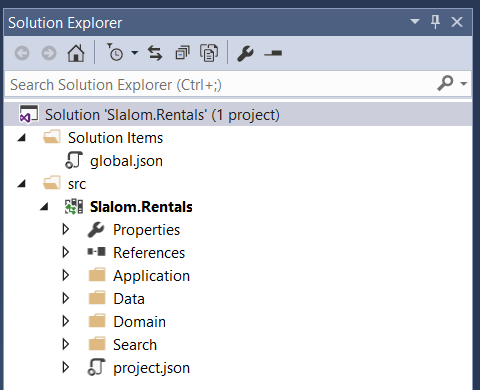

# Folder Guidelines

This section contains rules for how to folder items in a Stacks solution.

The root structure should always start with Application, Data, Domain, Search.  
> You may not use the Data and Search folders yet, but it is a good idea to add them.

## Application
The application folder contains all application logic: endpoints, rules, commands, interfaces.

Within the application folder, there should be subfolders for each bounded context, then service,
then endpoint.  The Make Reservation endpoint classes would be placed in "Application/Rentals/Reservations/Make".

There is one special folder within the Application folder named Integration.  This is 
where client access components and external commands are placed.

## Data
The data folder contains all data access logic: entity contexts, repositories and mappings.

## Domain
The domain folder contains all domain logic: aggregates, entities, value objects.

## Search
The search folder contains all search logic: search results, search indexers.