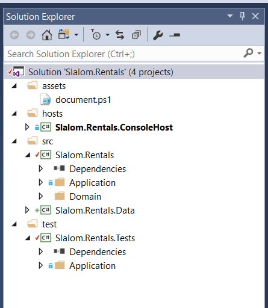

# Solution Guidelines

This section contains rules for how a Stacks Solution should be set up.  

## Solution Folders
The following solution folders help organize the solution in a functionally coherent way.

### Assets
The **assets** folder should hold global automation scripts, readme files and any other shared
assets.  Examples are the document.ps1 shown here and possibly a script that executes
"dotnet restore" for the solution.

### Hosts
The **hosts** folder should contain any project that actually run the solution.  There
may be one for a console based client; other possibilies may be web, powershell, etc.

### Source
The **src** folder should contain the core logic for the solution and any related items
such as data or implementation specific logic: file access, 3rd party access, etc.

### Test
The **test** folder should contain all tests.  In a service application this should
be Unit Tests and Integration Tests.  See the test overview for more information.

## Projects in this Example
The following projects are from the Slalom Rentals: Add Product walkthrough.  

### Console Host
The **Slalom.Rentals.ConsoleHost** is used to make direct calls to endpoints and to host
the Web API.

### Core Logic
The **Slalom.Rentals** contains most of the solution logic implemented as endpoints and a domain model.  There 
are some very specific folders that belong here and also have rules.

#### Application
The application folder contains all application logic: endpoints, rules, commands, interfaces.

Within the application folder, there should be subfolders for each service,
then endpoint (capability).  The Add Product endpoint classes would be placed in "Application/Products/Add".

There is one special folder within the Application folder named Integration.  This is 
where client access components and external commands are placed.

#### Domain
The domain folder contains all domain logic: aggregates, entities, value objects.

### Data
The **Slalom.Rentals.Data** project contains all data access logic: entity contexts, repositories and mappings.

### Tests
The **Slalom.Rentals.Tests** contains both acceptance tests and unit tests.

## Search
The search folder contains all search logic: search results, search indexers.