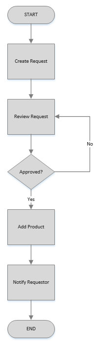

# Design Overview

[Introduction](#design) | [Use Cases](#use-cases) | [Service Contracts](#service-contracts)

This section first looks at the Request Product capability and creates two forms of developer
specifications: use cases and Service Contracts.

First let's look at the business process which has the following
activities: Create Request, Review Request, Approve Request, Add Product,
Notify Requestor.
> We should also notify the requestor on rejection, but this is a simple
> example so we will ommit.

We do not want to automate each activity and there are some 
activities that we simply cannot automate.  From the process above, below are the activities that we do want to automate.
* Create Request
* Approve Request
* Reject Request
* Add Product
* Notify Requestor

## Use Cases
Use cases are great for specifications and should include almost all
important details minus operational concerns.  They should be built
and agreed upon by the business analyst and the solution architect.

Below is an example of a use case for the Add Product activity.

**Name**:  Add Product
> The name of the use case, used for identification.

**Actor**: Request Approver
> The use case actor that will be executing the use case.

**Bounded Context**: Catalog
> The logical grouping of the use case.  Others would be shipping, payment, etc.

**Summary**: Adds a product to the product catalog so 
that a user can search for it and it can be added to a cart, rented, purchased and shipped.
> A short summary of the use case that also lists downstream activities.

**Input**:

| Name        | Description                              | 
| ----------- | ---------------------------------------- | 
| Name        | The name of the product to add.          | 
| Description | An optional description for the product. |

**Output**: Returns the ID of the added product.

**Events**:

Product Added Event

> List any events that need to be raised and possibly consumed.

**Rules**: 
1. A product with the same name does not already exist.
2. The user must be an employee.
> Listing them here makes it easy to test and validate.

**Post Conditions**:
1. A product with the name and description is added to the product catalog.
2. The product can be found in product search.
3. The response comes back in less than .5 seconds.
4. The Product Added Event is raised.
> Listing them here makes it easy to test and validate.

**Usage Index**:

.01n
> A number that indicates how many times the user will perform the action per visit.  This
> number is later used to validate the system under load.

## Service Contracts
Service contracts build on top of the use case and add some implementation/operation details.  They
are also to be defined and agreed upon by the business analyst and architect.
**Name**:  Add Product
> This should not change.

**Path**: catalog/products/add
> This is taken from the bounded context, service, and operation or endpoint.

**Version**: 1
> The implementation version.

**Timeout**: 5 seconds
> How long the operation should take at max.

**Summary**: Adds a product to the product catalog so 
that a user can search for it and it can be added to a cart, rented, purchased and shipped.
> This should not change.

**Input**:

| Name        | Description                              | Validation              |
| ----------- | ---------------------------------------- | ----------------------- |
| Name        | The name of the product to add.          | Name must be specified. |
| Description | An optional description for the product. |                         |
> Here we keep everything the same and add validation.

**Output**: Returns a string representing the ID of the added product.
> Added a type of the return.  If this was a complex object then we would want
> to list out the properties.  

**Events**: 

Product Added Event

| Name        | Description                              | 
| ----------- | ---------------------------------------- | 
| ID          | The added product ID.                    |
| Name        | The name of the product to add.          | 
| Description | An optional description for the product. |
> Details about any raised event(s) is provided here.  The properties
> of the events should contain enough information to replay the
> event.

**Rules**: 

| Number | Type     | Code                   | End-User Message                             | 
| ------ | -------- | ---------------------- | -------------------------------------------- |
| 1      | Security | UserNotEmployee        | You must be an employee to add a product.    |
| 2      | Business | NameNotUnique          | A product with the same name already exists. |
> Here we add implementation details that are used in discovery documents.
> The code should indicate why the condition was not met and lthe end-use message
> is a default.  The UI should use the code to come up with its own message.

That's it for our quick overview of the design.  Next is stubbing out classes and methods
or you can explore examples:
* [Add Product Use Case](add-product-use-case.md)
* [Add Product Service Contract](add-product-service-contract.md)