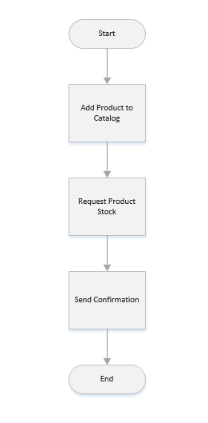

# Design

This section assumes that the project has had some form of business requirements analysis
that have been captured and document well.  There are two key inputs to serviced design:
1. A logical domain model and accompanying dictionary
2. Documented business processes as flow charts

What we are interested in generating is a set of use cases and service contracts.

## Use Cases
Use cases are derived from our business process flow charts.  Let's look at the following
Shopping example.

The use case for add product might look something like the following.

**Name**:  Add Product
> The name of the use case, used for identification.

**Bounded Context**: Catalog
> The logical grouping of the use case.  Others would be shipping, payment, etc.

**Summary**: Adds a product to the product catalog so that a user can search for it and it can be added to a cart, purchased and/or shipped.
> A short summary of the use case that also lists downstream activities.

**Input**:

| Name        | Description                              | 
| ----------- | ---------------------------------------- | 
| Name        | The name of the product to add.          | 
| Description | An optional description for the product. |

**Output**: Returns the ID of the added product.

**Rules**: 
1. A product with the same name does not already exist.
2. The use must be registered.
> Listing them here makes it easy to test and validate.

**Post Conditions**:
1. A product with the name and description is added to the product catalog.
2. The product can be found in product search.
> Listing them here makes it easy to test and validate.

## Service Contracts
Service contracts build on top of the use case and add some implementation specifics.  They
are still to be defined by the business analyst and architect.
**Name**:  Add Product
> This should not change.

**Path**: catalog/products/add
> This is taken from the bounded context, service, and operation or endpoint.

**Summary**: Adds a product to the product catalog so that a user can search for it and it can be added to a cart, purchased and/or shipped.
> This should not change.

**Input**:

| Name        | Description                              | Validation        |
| ----------- | ---------------------------------------- | ----------------- |
| Name        | The name of the product to add.          | Must not be null. |
| Description | An optional description for the product. |                   |
> Here we keep everything the same and add validation.

**Output**: Returns a string representing the ID of the added product.
> Added a type of the return.  If this was a complex object then we would want
> to list out the properties.  

**Rules**: 

| Number | Type     | Code                  | Name                    | End-User Message                             | 
| ------ | -------- | --------------------- | ----------------------- | -------------------------------------------- |
| 1      | Security | UserNotRegistered     | user must be registered | You must be registered to submit a product.  |
| 2      | Business | NameNotUnique         | name must be unique     | A product with the same name already exists. |
> Here we add implementation details that are used in discovery documents.